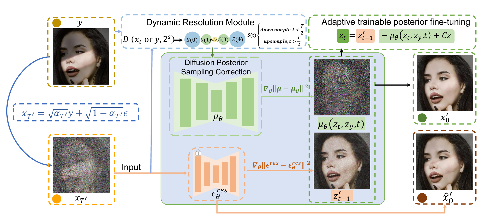
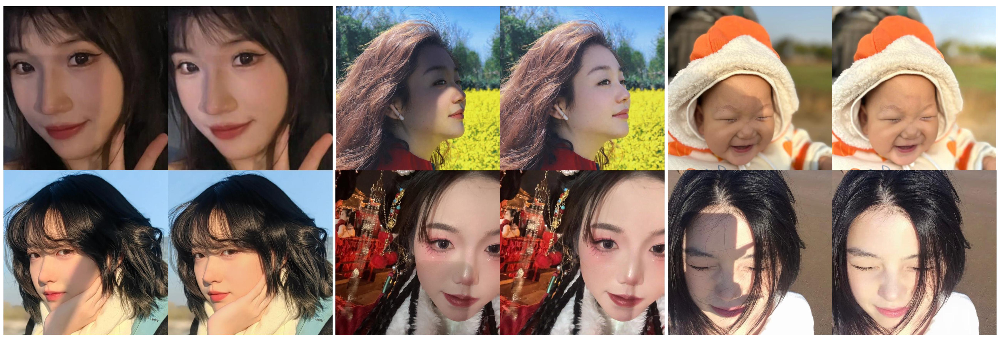

# LearnIR: Learnable Posterior Sampling for Real-World Image Restoration

<p align="center">
  <b>International Conference on Learning Representations (ICLR 2026)</b>
</p>

<p align="center">
  Yihang Bao<sup>1†</sup>,
  Zhen Huang<sup>2†</sup>,
  Shanyan Guan<sup>2</sup>,
  Songlin Yang<sup>2</sup>,
  Yanhao Ge<sup>2</sup>,
  Wei Li<sup>2</sup>,
  Bukun Huang<sup>3</sup>,
  Zengmin Xu<sup>1,4,5*</sup>
</p>

<p align="center">
  <sup>1</sup>Guilin University of Electronic Technology &nbsp;&nbsp;
  <sup>2</sup>vivo Mobile Communication Co., Ltd &nbsp;&nbsp;
  <sup>3</sup>Zhejiang Gongshang University <br>
  <sup>4</sup>Center for Applied Mathematics of Guangxi (GUET) &nbsp;&nbsp;
  <sup>5</sup>Anview.ai
</p>

<p align="center">
  † Equal Contribution &nbsp;&nbsp;&nbsp; * Corresponding Author
</p>

<p align="center">
  <a href="https://openreview.net/forum?id=aAb26aqU1E">
    
  </a>

  <a href="https://github.com/gityihang/LearnIR">
    
  </a>

  <a href="assets/poster.pdf">
    
  </a>
</p>

---

## 🔥 Abstract

Real-world image restoration is challenging due to heterogeneous degradations (haze, noise, shadows, blur). **LearnIR** is a learnable diffusion posterior sampling framework that:
- **Eliminates** the need for an explicit forward degradation operator.
- **DPSC**: Learns a correction model to maintain posterior consistency.
- **DRM**: Dynamically adjusts resolution across timesteps for better structure and detail.

---

## 🧠 Method
<p align="center">
  
</p>

### 1️⃣ Dynamic Resolution Module (DRM)
We introduce a time-dependent downsampling operator $\mathcal{D}(\cdot, s(t))$ to construct a resolution-aware latent space.

The latent residual is:

$$\mathbf{R}_\mathbf{z} = \mathbf{z}_y^{(t)} - \mathbf{z}_0^{(t)}$$

Forward diffusion process:

$$q(\mathbf{z}_t | \mathbf{z}_0^{(t)}) = \mathcal{N} \left( \sqrt{\bar{\alpha}_t}\mathbf{z}_0^{(t)} + (1-\sqrt{\bar{\alpha}_t})\mathbf{R}_\mathbf{z}, (1-\bar{\alpha}_t)\mathbf{I} \right)$$

> **Why DRM?** Low resolution in early stages strengthens global modeling; native resolution in later stages refines fine textures—all without a pretrained VAE.

### 2️⃣ Diffusion Posterior Sampling Correction (DPSC)
Standard denoising often lacks reverse posterior consistency. We learn the correction mean $\hat{\mu}_\theta$ via:

$$\mathcal{L}_{consistency} = \mathbb{E} \| \mu - \hat{\mu}_\theta \|_2^2$$

**Total Objective:**

$$\mathcal{L}_{total} = \mathcal{L}_{denoise} + \lambda \mathcal{L}_{consistency}$$

---

## 📊 Experiments

### FaceShadow Dataset (Ours)
A new real-world dataset focused on complex facial shadow removal:
- **1,000** High-quality test images.
- Diverse identities and lighting (Soft & Hard shadows).

### Visual Comparisons
<p align="center">
  
</p>

---

## 🙏 Acknowledgements

This work was supported in part by:
- Guangxi Natural Science Foundation (2024GXNSFAA010493)
- Guangxi Key Research and Development Program (JB2504240003)
- Shanghai Municipal Commission of Economy and Informatization (2024-GZL-RGZN-01008)
- National Natural Science Foundation of China (52262047, 61862015)
- Science and Technology Project of Guangxi (AD23023002, AD21220114)

---
## 📚 Citation
If you find this work useful, please cite:

```bibtex
@inproceedings{baolearnir,
  title={LearnIR: Learnable Posterior Sampling for Real-World Image Restoration},
  author={Bao, Yihang and Huang, Zhen and Guan, Shanyan and Yang, Songlin and Ge, Yanhao and Li, Wei and Huang, Bukun and Xu, Zengmin},
  booktitle={The Fourteenth International Conference on Learning Representations},
  year={2026}
}
